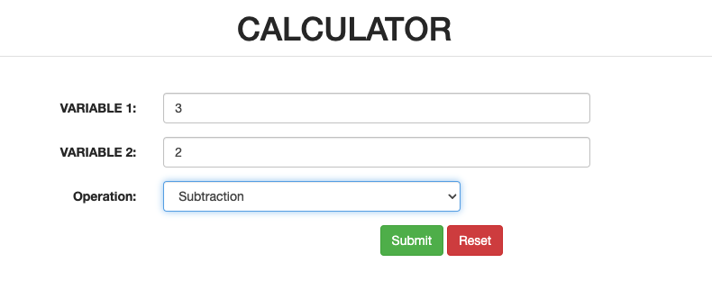
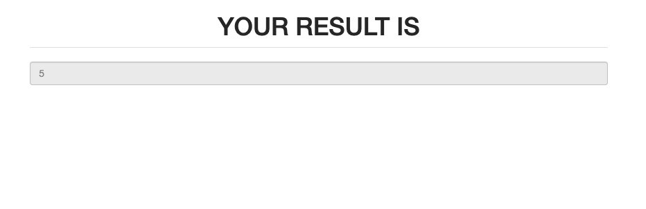

# Calculator App using Flask
Hello, Here is a simple flask application of Calculator which performs following Operations:

- Addition (OPERATION: +)

- Subtraction (OPERATION: -)

- Multiplication (OPERATION: *)

- Division (OPERATION: /)

Inside template/

**[1] form.html**

This carry data i.e. variables on which operations to be performed and operation code which has to be performed on variables.

**[2] result.html**

This displays the result of the user query.
This service is available at https://vsbmgxgs8v.us-east-1.awsapprunner.com/

How to Use:
-------------

Go to terminal and inside the project directory, and type the following command:

    $ python calc.py

* Example:

